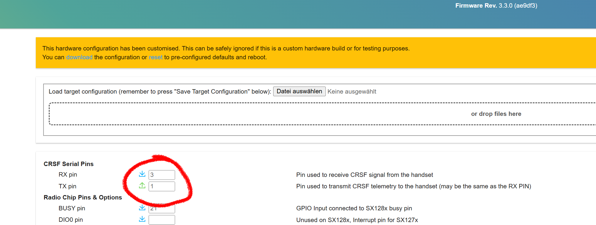
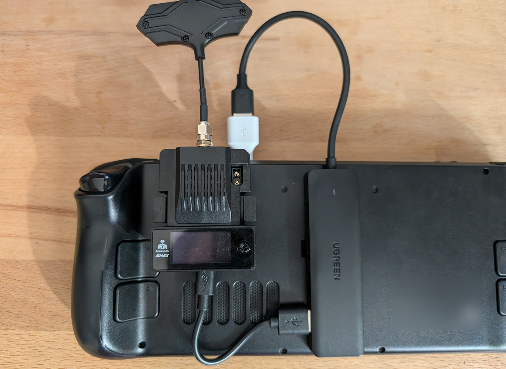

# ELRSctrl

Turn a **Steam Deck** (or any gamepad) into an RC transmitter for an **EMAX Aeris
Link / ExpressLRS (ELRS) TX module**. It reads the Deck's controls, lets you remap
any input to any of 16 RC channels, and streams **CRSF** frames to the module over
a serial port — exactly like an EdgeTX handset drives an external module.

Built for driving an RC car, but works for anything an ELRS receiver can control.

```
Steam Deck gamepad ─▶ mapping engine ─▶ CRSF frames ─▶ [serial] ─▶ ELRS TX module ──air──▶ RX ─▶ car
```

> ⚠️ **Safety first.** This commands a real vehicle.
> - The app boots **DISARMED** and transmits **failsafe** values until you arm it.
> - Arm/Kill are bound to gamepad buttons (default **Menu** = arm, **View** = kill)
>   and are also big buttons on the Monitor screen.
> - **Panic kill:** hold **LB+RB together for 500 ms** to force-disarm, regardless
>   of mapping or platform. Always works — even if Steam Input is eating your
>   configured Kill button (the gamepad cursor is hidden while armed, so this
>   chord is your guaranteed escape).
> - It auto-disarms if the gamepad disconnects or the UI stalls, and sends a
>   failsafe burst on exit.
> - **Test with the wheels off the ground / motor disconnected first.** Set a
>   sensible throttle **failsafe** (neutral for a bidirectional ESC).

---

## 1. Hardware & wiring

You need to get **CRSF serial data + power** into the module:

- **Power:** the module's **XT30** input (2S / ~8.4 V recommended). USB only powers
  the MCU — the RF stage needs the battery to actually transmit.
- **Data (pick one):**
  - **USB-C → CRSF (verified on the EMAX Aeris Link):** the module's USB is a
    **CP2102** bridge wired to the main MCU's **UART0** (GPIO 1/3). ELRS ships with
    CRSF on the **JR-bay pin** instead, which the USB bridge can't see — so the pin
    remap below is **mandatory** for the USB path, not optional tuning: it's what puts
    CRSF on the USB port at all. In the module's web UI (join its WiFi AP, then
    `http://10.0.0.1`): set **CRSF Serial RX = 3, TX = 1** (`/hardware.html`), turn
    **UART inverted OFF** (Options tab), and keep the **Backpack disabled**. The port
    shows up as `COMx` (Windows) or `/dev/ttyUSB0` (Linux, cp210x driver — *not*
    `ttyACM0`). Then run elrsctrl at **115200** baud.

    

    *In `http://10.0.0.1/hardware.html` → CRSF Serial Pins: **RX pin = 3**, **TX pin = 1**
    (circled). The yellow "hardware configuration has been customised" banner is
    expected after the change.*

  - **FTDI → JR-bay CRSF pin (fallback, not tested here):** wire a **3.3 V** USB-serial
    adapter's TX to the module's CRSF pin (JR bay, half-duplex). With UART-inverted
    **off** a plain non-inverted adapter works; with it on you'd need an inverting one.

> **⚠️ Cabling — a direct USB-C↔USB-C link to the Deck does *not* work.** The Aeris
> Link's Type-C socket is wired as a plain USB-2 device with **no USB-C CC resistors**,
> so a USB-C *host* (the Deck's only port) never detects it or switches on VBUS — the
> module stays dark and never enumerates (the tell: it won't even power up over the
> cable). A **USB-A host always supplies power + data**, which is why a plain
> **USB-A→C cable from a PC just works**. On the Deck, give it a USB-A path: a
> **powered USB-C hub/dock** with the module in one of its **USB-A** ports (via the
> USB-A→C cable), or a **USB-C→USB-A-female OTG adapter**. The **XT30 battery powers
> the RF stage but does *not* fix this** — it's a USB data/detection problem, not a
> power-budget one.



*Working setup on the Deck: a USB-C hub on the Deck's port, module plugged into one
of the hub's USB-A ports via a USB-A→C cable, XT30 battery powering the RF stage.*

- **Charging the Deck while connected:** the Deck has one USB-C port, so use a
  **USB-C hub/dock** with passthrough power if you want to charge while driving (the
  same hub gives you the USB-A port the module needs, above).

> **⚙️ Verified EMAX Aeris Link config (USB-C):** module web UI → CRSF serial
> **pins 3/1**, **UART inverted = off**, backpack off; elrsctrl **`--baud 115200`**,
> address `0xEE`. These are specific to *this* module's CP2102-on-UART0 design.
> **Other ELRS TX modules will differ** — USB-serial wiring, CRSF pins, inversion,
> and sometimes the baud — so treat this as a worked example, not universal settings,
> and always confirm with **sweep mode** before trusting the link.

The app is agnostic to the wiring — it opens a serial port at the configured **baud**
and streams CRSF. Note **115200** is the Aeris Link's handset-serial rate; the
oft-quoted **420000** is ELRS's *over-air* rate, **not** the serial baud. Confirm with
**sweep mode** (below) before trusting it.

---

## 2. Build

Install Go (1.22+): <https://go.dev/dl/>. Then, from the repo root:

```sh
go mod tidy     # resolves ebiten, go.bug.st/serial, yaml.v3, x/image and writes go.sum
go test ./...   # runs the CRSF + mapping unit tests
go run ./cmd/elrsctrl   # opens the UI on your dev machine (plug in any gamepad)
```

On **Windows** Ebiten needs no C compiler. On Linux/macOS dev machines it needs the
usual GL/X11/ALSA dev headers (see Ebiten's install docs).

### Build for the Steam Deck

The Deck is `linux/amd64` and Ebiten needs cgo **plus** the X11/OpenGL/ALSA *dev
headers* there. A Windows-hosted cross-compiler (e.g. `zig cc`) ships libc but not
those GUI headers, so it can't build Ebiten — build natively on Linux instead.

**From Windows via WSL2 (recommended):** one-time, inside `wsl`:

```sh
sudo apt-get update
sudo apt-get install -y gcc pkg-config xorg-dev libgl1-mesa-dev libasound2-dev
# + Go on PATH (https://go.dev/dl/); it auto-fetches the version in go.mod.
```

Then from the repo root in PowerShell:

```powershell
powershell -ExecutionPolicy Bypass -File scripts\build-linux.ps1   # -> dist\elrsctrl
```

The `.ps1` just runs `scripts/build-linux.sh` inside WSL. That same script also
builds **on the Deck** in a distrobox/toolbox container (same packages,
`bash scripts/build-linux.sh`).

> The build's glibc must be **≤ the Deck's** (SteamOS 3.x ≈ glibc 2.37) or it won't
> start. Building on an older distro (Ubuntu 22.04 = 2.35) is the safe side; the
> script prints the highest glibc the binary needs so you can check.

---

## 3. Deploy & run on the Steam Deck

> **Cabling reminder:** the Deck's single USB-C port **can't drive the module
> directly** — connect the module through a powered hub's **USB-A** port (see the §1
> cabling note). Also: the right serial node is `/dev/ttyUSB0` (cp210x); the Deck's
> own built-in controller shows up as `/dev/ttyACM0`, which is a trap — opening it
> "succeeds" but silently swallows every frame.

1. Copy `dist/elrsctrl` and a `config.yaml` (start from `config.example.yaml`) to
   `~/elrsctrl/` on the Deck and `chmod +x elrsctrl`.
2. **Run from Desktop Mode first.** This gives the app clean, raw access to the
   built-in controller. (In Game Mode, Steam Input intercepts non-Steam games and
   only forwards an emulated gamepad — workable for standard sticks/buttons, but
   Desktop Mode is the reliable path.)
3. Optional: add it as a **non-Steam game** to launch from Game Mode. If the
   controller doesn't respond, set that app's controller layout to a plain
   **Gamepad** template / disable Steam Input for it.
4. Runtime libraries (libGL, libX11/Xrandr/Xcursor/Xinerama/Xi, libasound2) ship
   with SteamOS; it runs under Game Mode via XWayland.

---

## 4. Using it

### Hardware bring-up (do this once, before driving)

Prove the serial link moves a servo/ESC on a bound receiver — no UI, no mapping:

```sh
./elrsctrl --port /dev/ttyUSB0 --sweep 1      # Aeris Link over USB (cp210x); sweeps CH1; Ctrl+C to stop
# Windows dev:  .\elrsctrl.exe --port COM4 --sweep 1
```

If the bound servo sweeps, your wiring/baud/address/CRSF pins are correct. If not,
re-check the verified config above (pins 3/1, inverted off, baud 115200), try another
baud from ELRS's autobaud list (400000/921600), or fall back to the FTDI→JR path.

### Normal use

```sh
./elrsctrl --config config.yaml          # or --fullscreen on the Deck
```

Three touch/mouse screens:

- **Monitor** — connection + frames/sec, gamepad status, a big **ARM/DISARM** and
  **KILL** button, and live bars for all 16 channels (µs + raw). Shows when failsafe
  values are being sent.
- **Mapping** — pick a channel on the left; on the right set its **Type**
  (none/analog/switch2/switch3/fixed), **Source**, **Reverse**, **Expo**,
  **Deadzone**, **Trim**, **endpoints**, switch positions, and **Failsafe**. Tap
  **BIND** then move a stick / press a button to assign it instantly.
- **Settings** — serial **Port** (+ Rescan), **Baud**, **Rate**, **CRSF Address**,
  **Gamepad** picker, **Arm/Kill** bindings and arm mode, plus **Save / Reload /
  Reset**.

Switch screens by tapping the tabs, or — handy on the Deck — with **LB / RB** while
**disarmed** (when armed, the bumpers stay free for your channel mappings).

### Default RC-car profile

| Channel | Function | Source |
|---|---|---|
| CH1 | Steering | Left Stick X |
| CH2 | Throttle | Triggers (R2 forward / L2 reverse), neutral failsafe |
| CH3 | Aux1 | A (toggle) |
| CH4 | Aux2 | B (toggle) |

Arm = **Menu**, Kill = **View**. Everything is remappable.

---

## 5. Config reference

See [`config.example.yaml`](config.example.yaml) for the full annotated format
(serial, sender, safety, and the 16 channel definitions, including the source
names and tick values).

---

## 6. CRSF details

Frames are `RC_CHANNELS_PACKED`: `[addr=0xEE][len=0x18][type=0x16][16ch × 11-bit,
LSB-first][CRC8]`, CRC8 = DVB-S2 (poly 0xD5) over `[type+payload]`, at the module's
handset-serial baud (**115200** on the Aeris Link over USB; 420000 is the over-air
rate, *not* the serial baud — ELRS's handset autobaud accepts 400000/115200/921600…).
Ticks map 172→~1000 µs, 992→1500 µs (center), 1811→~2000 µs. Implementation and
unit tests are in [`internal/crsf`](internal/crsf).

---

## 7. Troubleshooting

- **Module won't power up / no serial port over USB-C:** a **direct USB-C↔USB-C** link
  to the Deck won't power or enumerate the Aeris Link (its Type-C socket has no CC
  resistors). Use a **USB-A host path** — a powered hub/dock with the module in a
  **USB-A** port, or a USB-C→USB-A-female OTG adapter. XT30 power alone won't fix it
  (see §1).
- **No port listed:** check the cable/driver; on Linux ensure your user can access
  the device (`sudo usermod -aG dialout,uucp $USER`, then re-login) or run with
  access to `/dev/ttyACM*`.
- **Port connects but nothing moves:** verify with `--sweep`; confirm the module is
  powered via XT30, the **baud matches the module** (115200 for the Aeris Link over
  USB), the CRSF serial pins/inversion are set (3/1, inverted off on the Aeris Link),
  address is 0xEE, and the RX is bound.
- **Module connects but the servo/ESC doesn't respond:** check which **RX output
  channel** the servo/ESC is wired to — `--sweep N` drives CRSF channel *N*, so a
  servo on RX output 4 only moves with `--sweep 4`. Match your RX outputs to the
  channel map (default profile: CH1 steering, CH2 throttle).
- **Gamepad not detected / double input on the Deck:** run from Desktop Mode, and in
  Settings use the **Gamepad** picker to select the right device.
- **Car twitches when you tab away:** expected — the app sends failsafe when the
  snapshot goes stale or it loses input. Re-arm to resume.

---

## 8. 3D-printable parts

Optional STL files for kitting out the vehicle live in [`3dprinting/`](3dprinting):

- [`CameraAndVtxBox.stl`](3dprinting/CameraAndVtxBox.stl) — a box that holds an
  analog FPV camera and a VTX (video transmitter).
- [`Chassis_Connector.stl`](3dprinting/Chassis_Connector.stl) — a connector that
  mounts a custom vehicle cover/body to the **Traxxas Maxx** chassis.
- [`Waterpistole_holder_02.stl`](3dprinting/Waterpistole_holder_02.stl) — a mount
  for the **X-Shot** water pistol, with a spot for a servo (drive it from a
  `switch2` channel in **pulse** mode for repeated trigger pulls).
